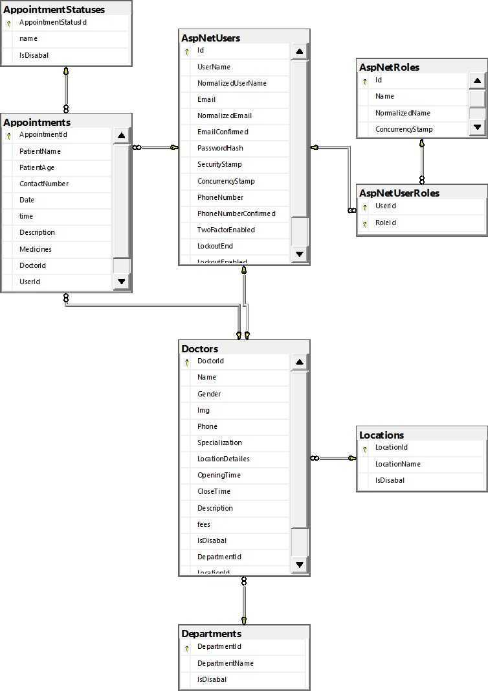

# Clinics Center API

Welcome to the Clinics Center API, designed for booking doctor appointments online.

## Authentication and Authorization

### JSON Web Tokens (JWT)

The Clinics Center API employs JSON Web Tokens (JWT) for secure authentication and authorization. JWT is a compact, URL-safe means of representing claims between two parties. In our API, JWTs are utilized to verify the identity of users and determine their access rights.

#### How it works:

1. **User Registration:**
   - Clients, doctors, and administrators can register using the respective endpoints.
   
2. **User Login:**
   - Upon successful registration, users can log in using the `/api/User/login` endpoint.
   - The server issues a JWT containing user information and roles.

3. **Token Usage:**
   - Clients must include the JWT in the Authorization header of subsequent requests.
   - The API validates the token and authorizes the user based on their assigned role (Admin, Doctor, Patient).

### Roles

The Clinics Center API implements role-based access control for different user types:

- **Admin:**
  - Has access to administrative functionalities such as creating departments, updating information, and managing users.
  
- **Doctor:**
  - Can view and update appointments, manage personal information, and access relevant data based on their role.
  
- **Patient:**
  - Can create appointments, view personal appointment history, and interact with the system based on their permissions.

## Database - SQL Server

The backend of the Clinics Center API relies on Microsoft SQL Server as the relational database management system. SQL Server is used to store and manage data related to users, appointments, departments, doctors, and other entities.
## ERD

## Endpoints

### Appointments
- **POST** /api/Appointments/creat
- **GET** /api/Appointments/Client/appointments
- **GET** /api/Appointments/Client/appointment/{appointmentId}
- **GET** /api/Appointments/Doctor/appointments
- **GET** /api/Appointments/appointmentStatus
- **GET** /api/Appointments/Doctor/appointments/appointmentStatus
- **GET** /api/Appointments/Doctor/appointment/{appointmentId}
- **PUT** /api/Appointments/Doctor/appointments/Update
- **GET** /api/Appointments/Client/appointments/appointmentStatus

### Departments
- **GET** /api/Departments/GetDepartments
- **GET** /api/Departments/GetLocations
- **GET** /api/Departments/GetDepartmentDoctors
- **POST** /api/Departments/CreateDepartment
- **PUT** /api/Departments/UpdateDepartment
- **DELETE** /api/Departments/UpdateDepartment

### Doctors
- **GET** /api/Doctors/Doctor/{doctorId}
- **GET** /api/Doctors/DateSlots
- **GET** /api/Doctors/doctors/location/{locationId}
- **GET** /api/Doctors/doctors/department/{departmentId}
- **GET** /api/Doctors/doctors/location/{locationId}/department/{departmentId}

### User
- **POST** /api/User/RegisterUser
- **POST** /api/User/RegisterAdmin
- **POST** /api/User/RegisterDoctor
- **POST** /api/User/login

## Usage

To use the Clinics Center API, send HTTP requests to the provided endpoints using tools like Postman or integrate it into your application. The API handles various aspects of clinic management, including appointments, departments, doctors, and user registration/authentication.

